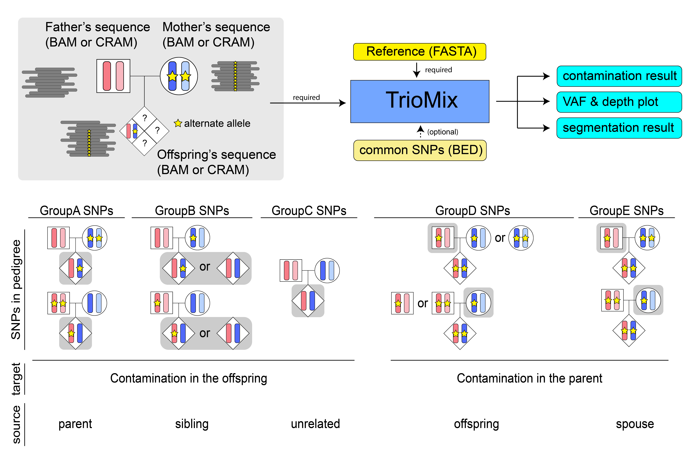

# TrioMix
Quantification of contamination, uniparental disomy (UPD), and chimerism in whole-genome or whole-exome sequencing data of parent-offspring trio. 

For details, please visit [https://triomix.readthedocs.io](https://triomix.readthedocs.io/en/latest/). 

